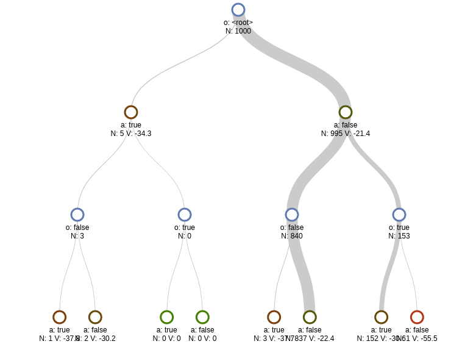

# BasicPOMCP

[](https://travis-ci.org/JuliaPOMDP/BasicPOMCP.jl)
[](https://coveralls.io/github/JuliaPOMDP/BasicPOMCP.jl?branch=master)
[](http://codecov.io/github/JuliaPOMDP/BasicPOMCP.jl?branch=master)

This package implements the PO-UCT online tree search algorithm for [POMDPs.jl](https://github.com/JuliaPOMDP/POMDPs.jl). PO-UCT is the most useful component of the POMCP algorithm described in \[1\]. The other component of POMCP, re-use of particles in the tree for belief updates, is not implemented for reasons described in the [Belief Update](#belief-update) section below.

> \[1\] Silver, D., & Veness, J. (2010). Monte-Carlo Planning in Large POMDPs. In *Advances in neural information processing systems* (pp. 2164–2172). Retrieved from http://discovery.ucl.ac.uk/1347369/

Problems should be specified using the [POMDPs.jl](https://github.com/JuliaPOMDP/POMDPs.jl) interface. For more information, see the [POMDPs.jl documentation](http://juliapomdp.github.io/POMDPs.jl/latest/).

This package replaces the deprecated [POMCP.jl package](https://github.com/JuliaPOMDP/POMCP.jl). It has fewer features, but is much simpler.



## Installation

In Julia 1.0 and higher, BasicPOMCP is available on the JuliaPOMDP registry (and this registry is required to automatically get the MCTS dependency):

```julia
using Pkg
Pkg.add("POMDPs")
using POMDPs
POMDPs.add_registry()
Pkg.add("BasicPOMCP")
```

## Usage

```julia
using POMDPs, POMDPModels, POMDPSimulators, BasicPOMCP

pomdp = TigerPOMDP()

solver = POMCPSolver()
planner = solve(solver, pomdp)

for (s, a, o) in stepthrough(pomdp, planner, "s,a,o", max_steps=10)
    println("State was $s,")
    println("action $a was taken,")
    println("and observation $o was received.\n")
end
```

A minimal example showing how to implement a problem for the solver to use is here: https://github.com/JuliaPOMDP/BasicPOMCP.jl/blob/master/notebooks/Minimal_Example.ipynb

## Solver Options

Solver options are set with keyword arguments to the `BasicPOMCP` constructor. The options are described in the docstring which can be accessed with `?POMCPSolver`.

The output of `?POMCPSolver` is printed below, but may not be up to date.

>     POMCPSolver(#=keyword arguments=#)
> 
> Partially Observable Monte Carlo Planning Solver.
> 
> ## Keyword Arguments
> 
> - `max_depth::Int`
>     Rollouts and tree expension will stop when this depth is reached.
>     default: `20`
> 
> - `c::Float64`
>     UCB exploration constant - specifies how much the solver should explore.
>     default: `1.0`
> 
> - `tree_queries::Int`
>     Number of iterations during each action() call.
>     default: `1000`
> 
> - `estimate_value::Any`
>     Function, object, or number used to estimate the value at the leaf nodes.
>     default: `RolloutEstimator(RandomSolver(rng))`
>     - If this is a function `f`, `f(pomdp, s, h::BeliefNode, steps)` will be called to estimate the value.
>     - If this is an object `o`, `estimate_value(o, pomdp, s, h::BeliefNode, steps)` will be called.
>     - If this is a number, the value will be set to that number
>     Note: In many cases, the simplest way to estimate the value is to do a rollout on the fully observable MDP with a policy that is a function of the state. To do this, use `FORollout(policy)`.
> 
> - `default_action::Any`
>     Function, action, or Policy used to determine the action if POMCP fails with exception `ex`.
>     default: `ExceptionRethrow()`
>     - If this is a Function `f`, `f(pomdp, belief, ex)` will be called.
>     - If this is a Policy `p`, `action(p, belief)` will be called.
>     - If it is an object `a`, `default_action(a, pomdp, belief, ex)` will be called, and if this method is not implemented, `a` will be returned directly.
> 
> - `rng::AbstractRNG`
>     Random number generator.
>     default: `Base.GLOBAL_RNG`


## Belief Update

This solver does not reuse decision-making simulations for the belief update as in the original Silver and Veness paper. We have found that unweighted particle filtering approach to be unuseful in practice because

1. The number of particles that comprise the next belief is small because only the particles in the branch corresponding to the actual action and observation can be used,
2. Even in the Silver and Veness paper, domain-specific particle reinvigoration must be used, and
3. The computation time required to run a standard weighted particle filter is small compared to the amount of time needed to plan with POMCP, so reusing the simulations gives minimal benefit.

Instead, a custom belief updater, or an updater from [ParticleFilters.jl](https://github.com/JuliaPOMDP/ParticleFilters.jl) should be used.

## Tree Visualization

The search tree can be visualized with [D3Trees.jl](https://github.com/sisl/D3Trees.jl) after running the `action_info()` as in the example below. **Note: tree_in_info must be set to true either as a solver option or as a keyword argument to action_info() for this to work** (it is disabled by default because it can use a lot of memory).

```julia
using POMDPs
using BasicPOMCP
using POMDPModels
using POMDPModelTools
using D3Trees
using Random

pomdp = BabyPOMDP()
solver = POMCPSolver(tree_queries=1000, c=10.0, rng=MersenneTwister(1))
planner = solve(solver, pomdp)
a, info = action_info(planner, initialstate(pomdp), tree_in_info=true)

inchrome(D3Tree(info[:tree], init_expand=3))
```

This should produce the image at the top of the README.
